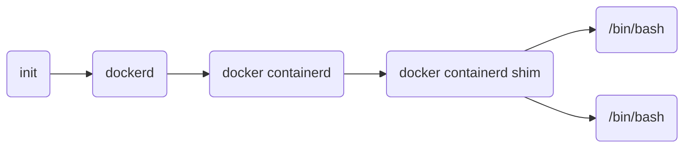

容器化关键技术。

一个运行态容器（running container）被定义为一个可读写的统一文件系统加上隔离的进程空间和包含其中的进程。

## 三大支柱

- Namespaces
- Control Group
- Union Filesystem

### Namespaces

命名空间(Namespaces)是[[Linux]]提供的用于分离进程树、网络接口、挂载点以及进程间通信等资源的方法。

目前共有八种命名空间：

| Namespace | Flag            | Page                      | Isolates                             |
| --------- | --------------- | ------------------------- | ------------------------------------ |
| Cgroup    | CLONE_NEWCGROUP | **cgroup_namespaces**(7)  | Cgroup root directory                |
| IPC       | CLONE_NEWIPC    | **ipc_namespaces**(7)     | System V IPC, POSIX message queues   |
| Network   | CLONE_NEWNET    | **network_namespaces**(7) | Network devices, stacks, ports, etc. |
| Mount     | CLONE_NEWNS     | **mount_namespaces**(7)   | Mount Points                         |
| PID       | CLONE_NEWPID    | **pid_namespaces**(7)     | Process IDs                          |
| Time      | CLONE_NEWTIME   | **time_namespaces**(7)    | Boot and monotonic clocks            |
| User      | CLONE_NEWUSER   | **user_namespaces**(7)    | User and group IDs                   |
| UTS       | CLONE_NEWUTS    | **uts_namespaces**(7)     | Hostname and NIS domain name         |

#### 进程

进程是[[Linux]]以及现在操作系统中非常重要的概念，表示一个正在执行的程序，是现代分时系统中的一个任务单元。

当容器运行时，系统上的进程树可能如下所示：



#### 网络

每一个使用 `docker run` 启动的容器其实都具有单独的网络命名空间，Docker 提供了四种不同的网络模式

- Host
- Container
- Bridge
- None

除了分配隔离的网络命名空间以外，Docker 还会为所有的容器设置 IP 地址。当 Docker 在主机上启动之后会创建新的虚拟网桥 docker0，随后在该主机上启动的全部服务在默认情况下都与该网桥相连。

```shell
# 查看当前网桥的接口
brctl show

# 查看 iptables 配置
iptables -t nat -L
```

假设通过 `docker run -d -p 6379:6379 redis` 启动了新的 Redis 容器，再执行上述命令就可以看到新的规则了。

```shell
DNAT       tcp  --  anywhere             anywhere             tcp dpt:6379 to:192.168.0.4:6379
```

上述规则会将从任意源发送到当前机器 6379 端口的 TCP 包转发到 `192.168.0.4:6379` 所在的地址上。

#### 容器网络模型

The goal of libnetwork is to deliver a robust Container Network Model that provides a consistent programming interface and the required network abstractions for applications.

#### 挂载点

在新的进程中创建隔离的挂载点命名空间，需要在 `clone` 函数中传入 `CLONE_NEWNS`，这样子进程才能得到父进程挂载点的拷贝；**如果不传入这个参数，子进程对系统的读写都会同步回父进程以及整个主机的文件系统**

如果一个容器需要启动，那么它一定需要提供一个根文件系统 (rootfs)，容器要使用这个文件系统来创建一个新进程，所有二进制的执行都必须在这个根文件系统中。

- `/proc`
- `/dev`
- `/dev/shm`
- `/dev/mqueue`
- `/dev/pts`
- `/sys`

同时，还使用 `chroot` 改变当前的系统根目录结构。

### CGROUP

Control Group，为限制进程的物理资源而诞生，例如 CPU、内存、硬盘 IO 和网络带宽。

每一个 CGroup 都是一组被相同的标准和参数限制的进程，不同的 CGroup 之间是树级结构，可以从父类继承相应的数据。

通过 `lssubsys -m` 查看当前的 CGroup 中有哪些子系统

安装 Docker 时会在所有子系统的目录下新建 docker 文件夹；在 Docker 启动容器时，则会在 docker 的目录下再新建隶属于该容器的文件夹。通过这种方式，实现了容器的资源管理能力。

### Union FS

Docker 镜像本质上就是一个压缩包。

Docker 中的镜像都是由一系列只读的层组成的，Dockerfile 中的每一个命令都会在已有的只读层上创建一个新的层

```Dockerfile
FROM ubuntu:15.04
COPY . /app
RUN make /app
CMD python /app/app.py
```

当镜像被  `docker run`  命令创建时就会在镜像的最上层添加一个可写的层，也就是容器层，所有对于运行时容器的修改其实都是对这个容器读写层的修改。

UnionFS 是一种为 Linux 操作系统设计的用于把多个文件系统「联合」到同一个挂载点的文件系统服务。而 AUFS 即 Advanced UnionFS 其实就是 UnionFS 的升级版，它能够提供更优秀的性能和效率。

![[../images/docker-container-image.png]]

## Docker 使用技巧

### 日志相关

按时间区间查询日志内容

`docker logs --since='2022-08-29T15:04:00Z' --until='2022-08-29T15:05:59Z' asd234nsdf > log.log`

### 配置文件

如果 `systemctl start docker` 失败，可以执行 `dockerd --debug` 命令查看错误信息。

```json
// /etc/docker/daemon.json
{
  "debug": true,
  "max-concurrent-downloads": 20,
  "log-driver": "json-file",
  "log-level": "warn",
  "log-opts": {
    "max-size": "10m",
    "max-file": "3"
  },
  "registry-mirrors": [
    "https://registry.docker-cn.com",
    "https://docker.mirrors.ustc.edu.cn"
  ],
  "data-root": "/data/data-docker"
}
```

## References

- [Linux Namespaces](https://man7.org/linux/man-pages/man7/namespaces.7.html)
- [libnetwork](https://github.com/moby/libnetwork/blob/master/docs/design.md)
- [libcontainer](https://github.com/opencontainers/runc/blob/master/libcontainer/SPEC.md)
- [Docker 核心技术与实现原理](https://draveness.me/docker/)
- [Linux isolation](https://www.toptal.com/linux/separation-anxiety-isolating-your-system-with-linux-namespaces)
- [Container Networking Is Simple](https://iximiuz.com/en/posts/container-networking-is-simple/)
