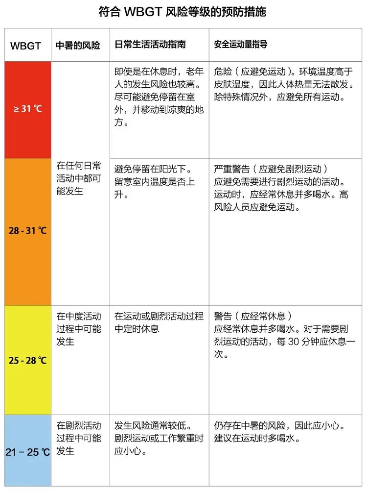

跑步前的拉伸相关知识可见 [[如何拉伸]]

## 防暑

- 预防中暑可参考 [[中暑措施]]
- WBGT指数「Wet Bulb Globe Temperature」，即暑热指数。作为一种综合性的温度指标，不仅考虑到了温度，还考虑到了湿度和热辐射。
	- 公式 $$(WBGT) = 1(湿度)*7(温度)*2(辐射热)$$
	- 当WBGT大于28度时，热伤害类的病发作率会激增
	- 

## 补充水分

- 运动前 - 至少4h饮水5-7ml/kg
- 运动中
	- 脱水不要超过2%体重
	- 补充的液体应包含20-30mEq的钠，2-5mEq的钾，5%-10%的碳水化合物
- 运动后
	- 正常食物和饮料的补充有助于水合状态的恢复
	- 如果要快速恢复，体重没丢失1kg需饮水1.5L

## 热身

- 作用
	- 预防跑步损伤
	- 提高跑步体验
- 热身动作
	- ![[../images/拉伸髂腰肌.gif]]
	- ![[../images/活动胸椎.gif]]
	- ![[../images/勾脚垫脚.gif]]

## 人民日报的跑步要点

- **选择适合的跑鞋和场地**
	- 工欲善其事，必先利其器。
	- 开始跑步之前，为自己挑选一双材质柔韧，鞋底软硬适中的跑鞋，是很有必要的。
	- 只有跑起来舒服，才能更长久地坚持下去，爱上跑步。
	- 场地最好也是软一点的有弹性的塑胶跑道。
	- 不仅可以保护膝关节，万一不慎摔倒，还能保护自己。
- **跑前要热身，跑后要拉伸**
	- 运动健身，也要注意安全，且不可使用蛮力。
	- 跑前热身，做12~15分钟的手臂伸展，蹲起等一些简单的动作。
	- 身体活动开，才能更好地进入运动状态。
	- 跑后拉伸、慢走、深呼吸，让肌肉慢慢放松下来，给身体一个缓冲时间。
- **设定自己的跑步频率**
	- 古人说，成大事者，不着急。
	- 跑步也是如此，不可操之过急，需要一个循序渐进的过程。
	- 否则，身体没有锻炼，反而添了一身伤病，就得不偿失了。
	- **跑步圈有12字箴言：从慢到快，以短求长，积少成多。**
	- 一般，每周运动2.5~5小时，每次半小时，就可以达到锻炼的效果。
	- 运动不是一朝一夕，而在于长期坚持。
- **掌握正确的跑步姿势**
	- 方法用对，事半功倍。
	- 跑步时，眼睛自然注视前方，不低头，不东张西望。
	- 身体略微前倾，让你的重心在两脚中间；
	- 脚后跟先着地，身体不要晃动；
	- 双臂尽可能贴近躯干，摆动不要过大。
	- 掌握正确的姿势，避免跑伤身体。
- **合理规划跑步时间和周期**
	- 不同的时间段，有不同的功效和利弊。
	- 晨跑可以使一天精神饱满，但也不要过早，晨跑前不要吃早餐。
	- 午后跑，可以使身体充分预热，但容易影响消化，饭前一个半小时不要做运动。
	- 夜间跑，减肥效果最佳，但要选择人多，光线充足的地方。
	- 最好结伴而行，注意自身安全。
	- 每周锻炼4天，休息3天，隔天锻炼一次。
	- 生活有秩序，健康有保证。

## References

- [敬畏热度、保持热情：如何在夏季坚持跑步](https://sspai.com/post/74342)
