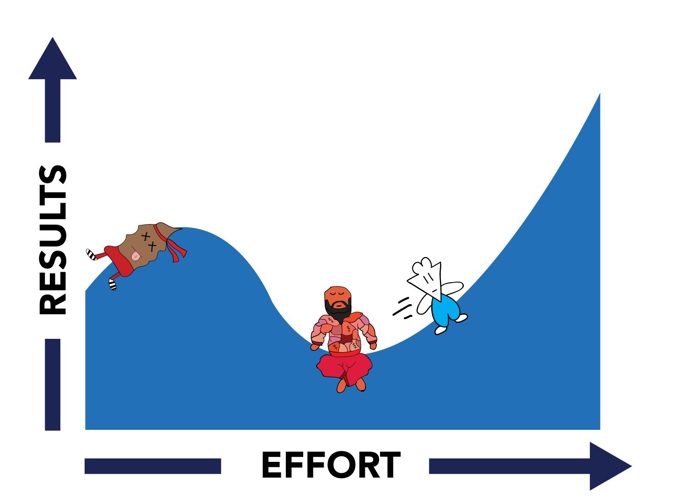

如何在某个领域上从新手成为大师

## 三大拦路虎 & 解决方案

### Laziness - **Perception** 懒惰

- The stronger the regret associated with that laziness, the more the endeavor actually means to you.
- A broadly defined goal is Laziness' best friend, as the hugeness of it will constantly freak you out.
- Instead of viewing a goal as something to be reached in its sheer totality, treat each day as a compartment that has its own small aspiration attached to it.

### Self Doubt - **Reflection** 自我怀疑

- As you continue investing time and effort into your endeavor, you notice that things aren't as easy as you thought they'd be.
- Underneath the rough texture of Self-Doubt's immediate appearance, you will notice that its skin is made up of everything you've once loved, everything you once cared deeply about, and everything you've also failed at as well.
- Evaluating its presence throughout your journey is critical to understand your relationship with the endeavor, and it's important to remind yourself that it ultimately is a reflection of love.

### Uncertainty - **Inner Child** 不确定性

- The over-identification of ourselves with this one pursuit exaggerates its magnitude, blurring out everything else and fogging up what life actually looks like.
- We need to analyze the ways we react to Uncertainty, and try to understand what's going on underneath-the-hood of these emotions.
- Stay curious, ask what and how.

## References

- [The Quest to the Unlived Life](https://moretothat.com/the-quest-to-the-unlived-life/)
