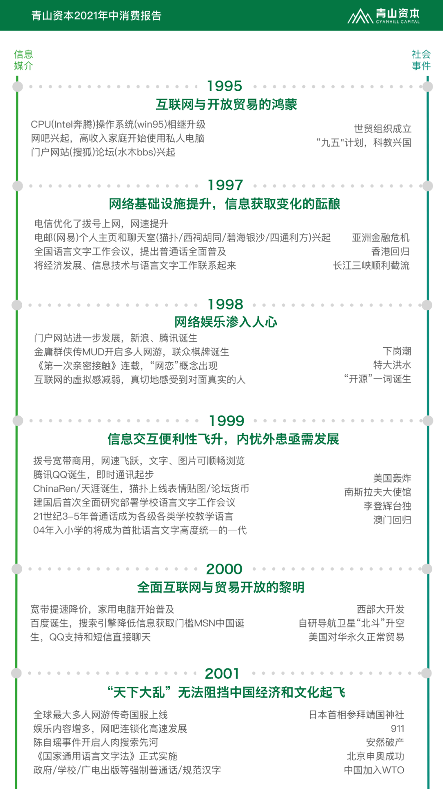
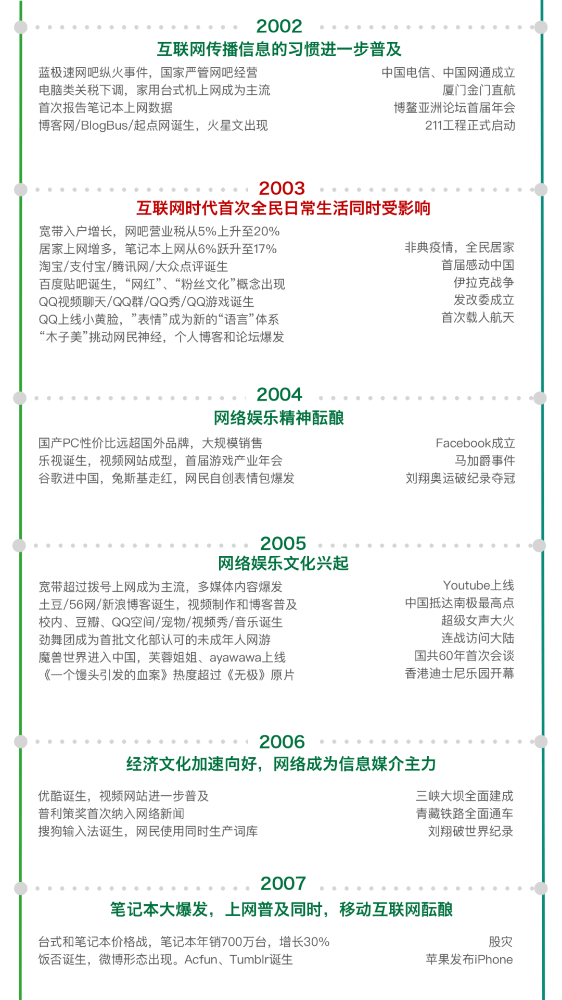
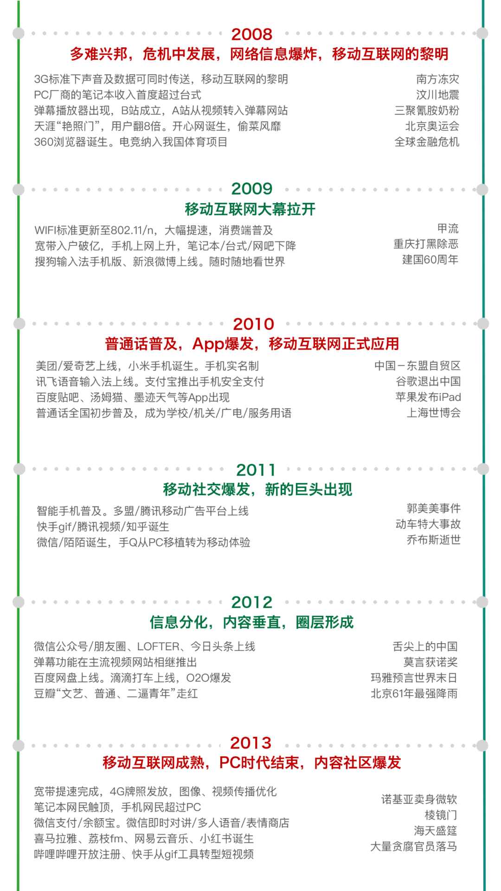
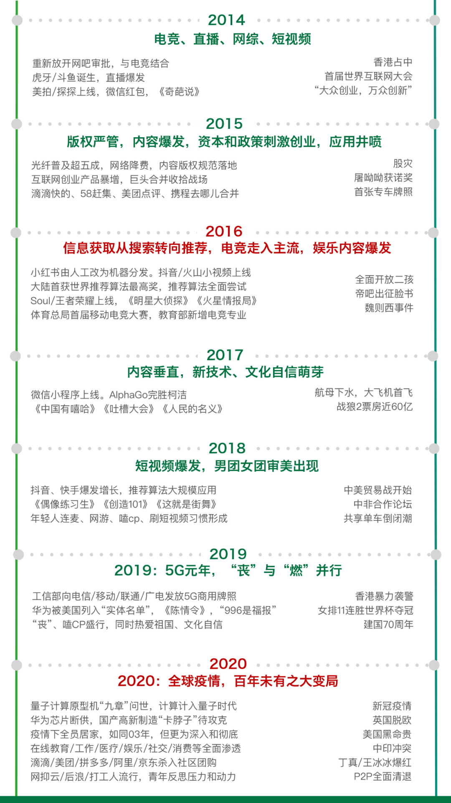
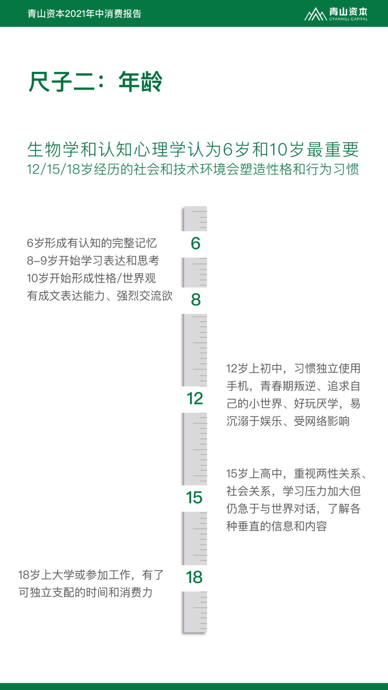
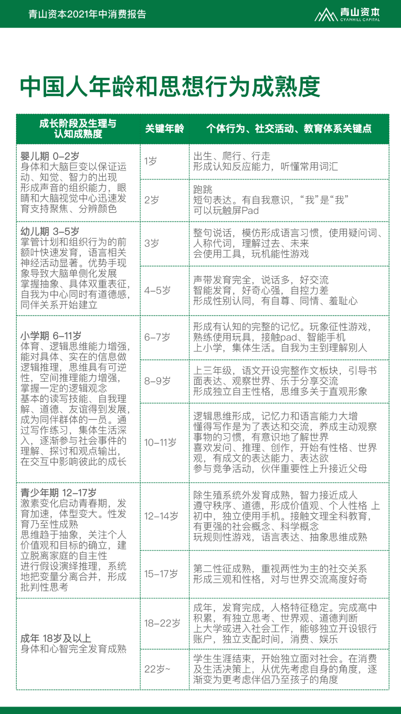

1998-2014

- 世代并非一个固定尺寸的盒子，可以使用出生年份按 5 年/10 年把人整齐收纳
  - 一个世代被单独划分，是地域上关联的一群人，在成长中同时经历了一些重大社会、科技和文化事件，共同的集体记忆使得其三观趋同
  - 同时日常生活习惯有同等的技术、产品、环境的支持，从而增强了对这一群人特征的可预测性，最终塑造了相似的消费观
- 信息媒介、社会事件、成长周期
- 历史事件、年龄段
- 
- 
- 
- 
- 
- 

## References

- 阅读 [Z 世代定义与特征](https://mp.weixin.qq.com/s/2NCxms2OsCBYRpmAHUQ4ug)
